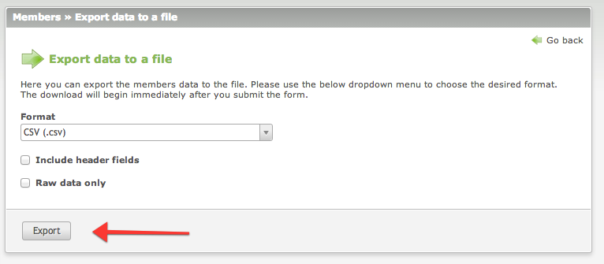

# Member Export – Documentation

## How to use

The data can be exported in the `Members` module. Simply click the button in the top right corner and you will be 
redirected to the export wizard. There you can choose which file format the data should be exported in. Addtiionally, 
you can set the data to be exported raw (not parsed) and optionally include the header fields.

The download will begin immediately after you click the `Export` button.



## Custom export format

You can also create your own export format. Please see the below example:

```php
// config/config.php
$GLOBALS['MEMBER_EXPORT_FORMATS']['my_format'] = array('MyClass', 'exportMyFormat');
 
// languages/en/tl_member.php
$GLOBALS['TL_LANG']['tl_member']['export_format_ref']['my_format'] = 'MyFormat (.myf)';
 
// classes/MyClass.php
public function exportMyFormat($blnHeaderFields, $blnRawData)
{
    $objWriter = new MyWriter();
    $this->exportFile($objWriter, $blnHeaderFields, $blnRawData);
}
```
