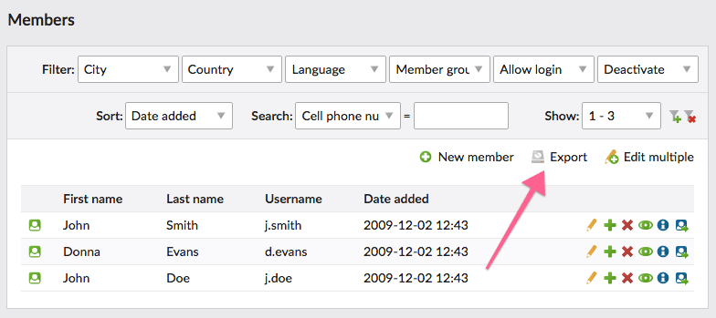

# Usage – Member Export bundle

1. [Installation](installation.md)
2. [**Usage**](usage.md)
3. [Developers](developers.md)


## How to export data

The data can be exported in the `Members` module. Simply click the button in the top right corner and you will be 
redirected to the export wizard. 



There you can choose which file format the data should be exported in. Additionally, you can set the data to be exported 
raw (not parsed) and optionally include the header fields.

The download will begin immediately after you click the `Export` button.


## Exclude fields from export

To exclude certain fields from the member export you can create the file `app/Resources/contao/dca/tl_member.php`
with the following content:

```php
<?php

/**
 * Exclude fields from member export
 */
$excludedFields = ['tstamp', 'password'];

foreach ($excludedFields as $field) {
    $GLOBALS['TL_DCA']['tl_member']['fields'][$field]['eval']['memberExportExcluded'] = true;
}
```

Afterwards you may need to rebuild the cache in Contao Manager or using the commands:

```
vendor/bin/contao-console cache:clear --no-warmup
vendor/bin/contao-console cache:warmup
```
